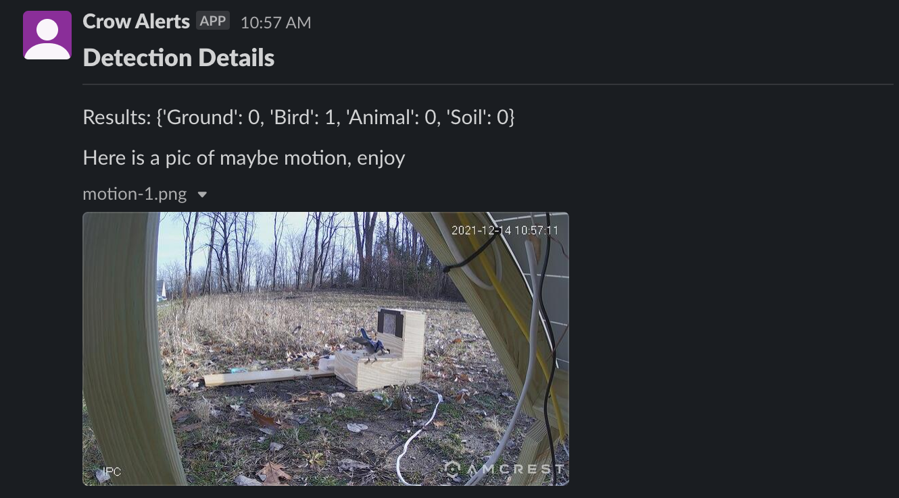

# Overview
This project contains a few of the components used in my Crow training/detection system.  There is a food dispenser and pile
of peanuts to feed the birds.  To monitor that, I have a custom built solar power rig, to power a 4k wifi camera which feeds
the video stream back to Home Assistant.

If the camera reports a motion event, Home Assistant fires off a series of automations to take still snapshots and notify me
of the motion, then submit one of the snapshots to AWS Rekognition for object detection.  If a bird is detected, a 2nd automation
will send another slack notification, with the boxed image of the detected bird, and a combined image with a time series of still
shots from the camera.

Home Assistant has a dashboard with the views of:
- The live camera feed
- Recent snapshots from motion events
- Status of the motion sensor and object detection process
- 1 hour history of the motion and detection process
- Button to toggle notifications on/off
- Button to manually trigger object detection


## Components Used
- A Raspberry Pi 4b running [Home Assistant](https://www.home-assistant.io/)
- My [ha_rekognition Home Assistant integration](https://github.com/bpeters-mcis/ha_rekognition) for Home Assistant
- An Amcrest 4k Wifi camera
  - A 100W solar panel
  - A 12v car battery
  - A solar charge controller
- Slack account
- AWS account


## File Structure
```
│   ###########################
│   # Home Assistant components
│   ###########################
│ 
│   # This is the basic lambda layer with shared modules/flask/sqlalchemy
├── Home Assistant                        
│   ├── automations.yml                 # Automations to handle motion detection and notifications                
│   ├── binary_sensors.yml              # Binary sensor configuration  
│   ├── cameras.yml                     # Camera configuration
│   └── dashboard.yml                   # Lovelace Dashboard
│ 
│   ###########################
│   # Misc
│   ###########################
│ 
└── Images                               # Images used in this readme!
```


## Example Images
### Home Assistant Camera Dashboard

### Slack Notification For Motion Detection

### Slack Notification For Confirmed Bird Detection
